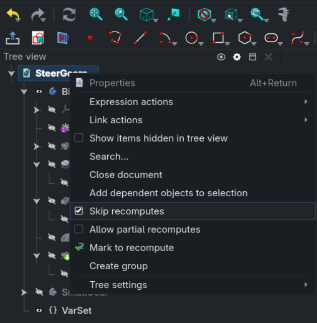

# SteerGear

English | [Português](Readme.ptBR.md)

Customizable gear set for steering wheels - Created for use with AgOpenGPS

Parametric project built in FreeCAD to generate custom gears for tractor for steering wheel.

<br>

Created using [Freecad](https://www.freecad.org/downloads.php) 1.0.0 with [freecad.gears workbench](https://github.com/looooo/freecad.gears)

Download [`SteerGears.FCStd`](SteerGears.FCStd)

## Variables

The `VarSet` contains all the available variables, it is located in the project document, below both bodies.

Customizable:

- `big_teeth_count`: Integer - Number of teeth of the big gear - tested in the 30-60 range
- `small_teeth_count`: Integer - Number of teeth of the small gear
- `height`: Float - Overall height of the gears
- `module`: Float - Module of the gear teeth
- `teeth_angle`: Angle - Helix angle of the gear teeth

Read only variables - Used for internal computation and as a summary of the gears info

- `big_diameter`: Float - Diameter of the big gear
- `big_diameter_inner`: Float - Inner diameter of the big gear (inside the supports)
- `big_support_length`: Float - Length available for support on the big gear - Used to calculate the number of holes possible in the support piece
- `gear_ratio`: Float - Ratio between big and small gear (big/small)

The number of holes in the support will adapt automatically based on the available support length.

## Export

Update the Tesselation settings to a smaller value than the FreeCAD default:

<br>

Select the `BigGear` body, go to "File" and then "Export". Repeat the process for the `SmallGear`

## Fixes to possible problems

I recommend disabling automatic recompilation:

<br>

Then, after a gear parameter change, use the refresh button (🔁) to recompute

---

If navigation is very slow (hover, select, ...), you can launch FreeCad with the command:

```bash
QT_QPA_PLATFORM=xcb FreeCAD
```

More at [#16560](https://github.com/FreeCAD/FreeCAD/issues/16560)
